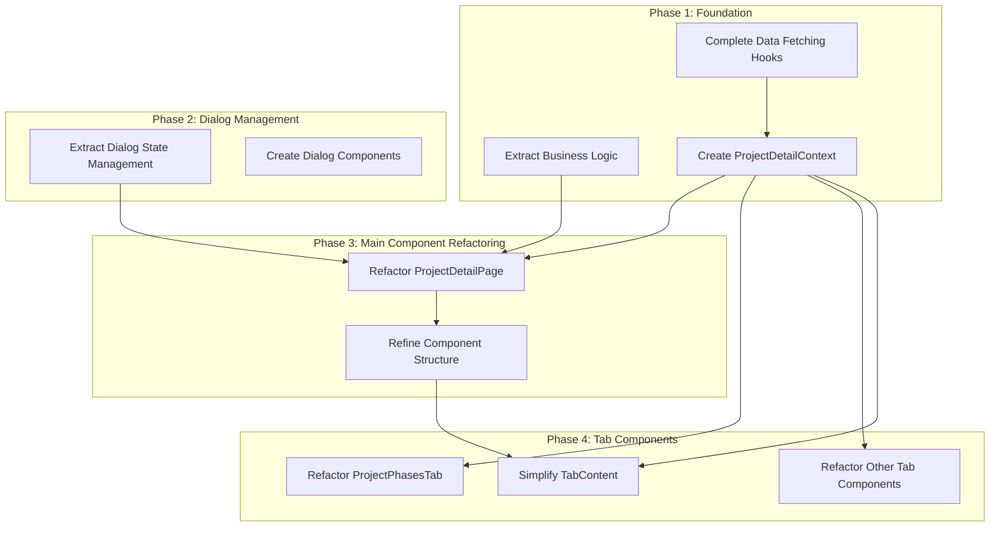

# Component Modularization Plan

**Date:** 2025-04-08
**Last Updated:** 2023-04-09

## Overview

This document outlines a detailed plan for modularizing overgrown components in the Construction Management App. It builds upon the existing [REFACTORING_PLAN.md](../../REFACTORING_PLAN.md) and [ProjectDetailPageRefactorPlan.md](./ProjectDetailPageRefactorPlan.md), focusing specifically on breaking down large components into manageable, maintainable units.

## Identified Overgrown Components

Through code analysis, we've identified the following components that require immediate attention:

1. **`ProjectDetailPage.tsx`** (~680+ lines)
2. **`ProjectPhasesTab.tsx`** (1000+ lines)
3. **Other Tab Components** (likely following similar patterns)
4. **`TabContent.tsx`** (excessive prop interface)

## Modularization Strategy by Component

### 1. ProjectDetailPage.tsx

*Current Status:* Partial refactoring started with data fetching hooks.

#### 1.1 Complete the Data Layer Extraction

- [x] Extract project data fetching (`useProject` hook - completed)
- [x] Extract phases data fetching (`useProjectPhases` hook - completed)
- [x] Extract bids data fetching (`useProjectBids` hook - completed)
- [x] Extract expenses data fetching (`useProjectExpenses` hook - completed)
- [x] Create a combined `useProjectData` hook to simplify usage

#### 1.2 Dialog State Management Extraction

- [ ] Create a `useDialogManager` hook for centralized dialog state management
- [ ] Extract dialog-specific logic into dedicated hooks:
  - [x] `useBidFormDialog` hook
  - [x] `useQuickAddSubcontractorDialog` hook
  - [x] `usePhaseDetailsDialog` hook
  - [x] `useExpenseFormDialog` hook

#### 1.3 Extract Business Logic

- [x] Move calculation functions to separate utility files:
  - [x] `projectMetrics.ts` for budget calculations
  - [x] `expenseAnalytics.ts` for expense breakdowns
  - [x] `phaseCalculations.ts` for phase costs and progress
  - [x] `timelineUtils.ts` for timeline calculations

#### 1.4 Create Dedicated Event Handler Modules

- [x] Extract phase-related handlers to `usePhaseOperations` hook
- [x] Extract bid-related handlers to `useBidOperations` hook
- [x] Extract expense-related handlers to `useExpenseOperations` hook
- [x] Extract project-related handlers to `useProjectOperations` hook

#### 1.5 Refine Component Structure

- [x] Create a `ProjectDetailHeader` component
- [x] Extract notification logic to a `useNotification` hook
- [ ] Create a `ProjectActionsMenu` component

### 2. ProjectPhasesTab.tsx

#### 2.1 Extract Visualization Components

- [ ] Create a `PhaseTimelineChart` component
- [ ] Create a `PhaseBudgetPieChart` component
- [ ] Create a `PhaseMetricsCards` component

#### 2.2 Extract Phase Card Component

- [ ] Create a `PhaseCard` component with the following sub-components:
  - [ ] `PhaseCardHeader`
  - [ ] `PhaseCardMetrics`
  - [ ] `PhaseCardActions`
  - [ ] `PhaseCardCharts`
  - [ ] `PhaseCardDetails` (expanded content)

#### 2.3 Extract Helper Functions

- [ ] Move `getPhasePayments` to a utility file
- [ ] Move `getPhaseBids` to a utility file
- [ ] Move `getPhaseExpenses` to a utility file
- [ ] Move status-related functions to a utility file

#### 2.4 Create Local State Hooks

- [ ] Create a `usePhaseExpandState` hook for expand/collapse state
- [ ] Create a `usePhaseMenuState` hook for menu state

### 3. Other Tab Components

Apply similar patterns to other tab components:

#### 3.1 ProjectOverviewTab.tsx

- [ ] Break into meaningful sub-components
- [ ] Extract visualization components
- [ ] Move calculation logic to utility files

#### 3.2 ProjectBidsTab.tsx

- [x] Extract `BidList` component
- [x] Extract `BidCard` component (replaces planned "BidSummary" component)
- [x] Extract `BidRow` component for simplified view
- [x] Extract `FilterPanel` component for filter controls
- [x] Extract `BidListHeader` component for search and actions
- [x] Create a barrel file for bid components
- [x] Extract dialog state management into a `useBidDialogs` hook
- [x] Extract bid-related calculations to utility files
- [x] Create a `BidListActions` component for action buttons

#### 3.3 ProjectExpensesTab.tsx

- [ ] Extract `ExpenseList` component
- [ ] Extract `ExpenseSummary` component
- [ ] Extract expense-related calculations to utility files

### 4. TabContent.tsx and Component Interfaces

#### 4.1 Replace Prop Drilling with Context

- [ ] Create a `ProjectDetailContext` to provide data to all tabs
- [ ] Create a `TabNavigationContext` for tab state and navigation

#### 4.2 Simplify Component Interfaces

- [ ] Reduce props passed to tab components by leveraging context
- [ ] Organize remaining props into logical interface groupings

## Implementation Order and Dependencies

## Testing Strategy

1. **Unit Tests:** 
   - Create tests for all extracted utility functions
   - Create tests for custom hooks (using `